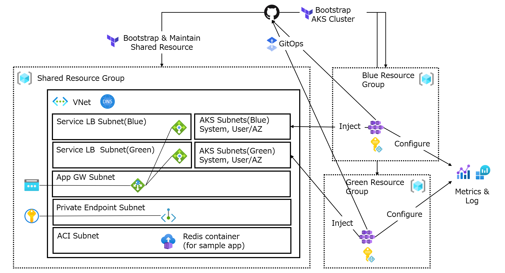

# Sample implementation of Azure Kubernetes Service "anti-DRY" bootstrap & maintenance strategy

## Table of Contents

- [Background](#background)
- [Prerequisites](#prerequisites)
- [Usage](#usage)
- [Notes](#notes)

## Background

It's hard to keep up with the evolution of Kubernetes. Significantly, upgrade strategy is a headache.

Blue/Green deployment is an effective strategy to mitigate the risk of upgrades. On the other hand, the challenge is how to manage the differences between the Blue and Green codes of infrastructure. DRY(Don't Repeat Yourself) is a typical concept that solves this problem, but its implementation tends to be cumbersome.

For example, there are several ways to achieve DRY with Terraform. Workspace, Module, specifying git tag as a source, git branching strategy & flow, etc. These are helpful ways, but it isn't easy to understand, design, operate, and maintain for developers early in the IaC and Kubernetes learning curve. In addition, in the rapidly evolving Kubernetes, it's common to want to redesign the code that creates the cluster. So, standardization of Blue/Green by Module often breaks down.

The codes in this repository are a sample of implementation of Azure Kubernetes Services Blue/Green bootstrap & maintenance without adopting DRY. Utilizing Terraform, Flux (v2), and GitHub Actions. The Blue and Green codes are not standardized, but the directories are split. In addition, it also has Terraform states for each environment. You can treat AKS clusters as immutable.

In this strategy, you should not persist data, state, and configuration in a cluster. All of them should be stored outside the cluster and connected for bootstrapping, configuration, running apps, and operation.



However, the difference of codes between Blue and Green must be easy to see. Therefore, this sample has support steps in CI, such as posting the diff as a comment at the time of Pull Requests.

DRY is a great concept, and you should be aware that it will come true in the future, but I hope this sample will serve as a starting point.

## Prerequisites

Prerequisites & tested

- [Terraform](https://www.terraform.io/docs/index.html): 1.6.5
  - hashicorp/azurerm: 3.84.0
  - Azure/azapi: 1.10.0
  - State store: Local
- [TFLint](https://github.com/terraform-linters/tflint): 0.49.0
  - [azurerm plugin](https://github.com/terraform-linters/tflint-ruleset-azurerm): 0.25.1
- [Azure/kubelogin](https://github.com/Azure/kubelogin): 0.0.34
- Ubuntu: 22.04.3 LTS

### Privileges required for execution

- Admin
  - Azure Subscription Owner (Azure role)
    - Need User Access Administrator for role assignment
  - Azure Kubernetes Service Cluster Admin Role (Azure role)
    - For admin operation & Flux execution
    - Assign role to Azure AD group and [specify](./terraform/blue/prod.tfvars) it as terrafofm var
  - GitHub Repo control (GitHub PAT)
    - For execution of Flux with GitHub
- GitHub Actions CI (Azure Service Principal)
  - Azure Subscription Reader (Azure role)
  - [Using OIDC auth for Terraform](https://registry.terraform.io/providers/hashicorp/azurerm/latest/docs/guides/service_principal_oidc)

In this sample, assigned strong privileges to admin so that you can try it smoothly for your PoC. In your actual operation, please be aware of the least privilege and fine-grained scope for you.

## Usage

### Prepare variables

The policy of this sample for variables such as IDs and secrets is as follows.

- Operate in a private repository
- Static IDs like Azure resource IDs can be written in the source code
  - To clarify the operation target and share it with the team as code
  - On the other hand, avoid hard code the entire ID as much as possible
    - Take advantage of Terraform interpolation and Flux substitution
  - Code encryption on repo is sometimes overkilling and complex procedures can trigger accidents
- Secrets and values generated without regularity not written in the source code
  - use Secret Store
    - Azure Key Vault and Secret Store CSI Driver
      - Create and inject automatically on this sample (Redis password for sample app)
        - Create secret and [store to Key Vault](./terraform/shared/main.tf)
        - [Pass](./terraform/blue/kubernetes-config/main.tf) configs like Azure AD Tenant ID to AKS as Kubernetes ConfigMap
        - Kustomize [SecretProviderClass](./flux/apps/base/demoapp/secret-provider-class.yaml) manifest [with ConfigMap and Flux substitution](./flux/clusters/blue/apps.yaml)
        - Pass Secret to sample app [as environment variable](./flux/apps/base/demoapp/deployment.yaml)
    - GitHub Secret
      - [For CI](./.github/workflows/ci-terraform-blue.yaml)
        - ARM_TENANT_ID: Azure AD Tenant ID
        - ARM_SUBSCRIPTION_ID: Azure Subscription ID
        - ARM_CLIENT_ID: Service Principal Client ID

You have to prepare the following variables for each envs(e.g dev, prod).

- Shared: [Terraform tfvars](./terraform/shared/dev.tfvars)
- Blue/Green: [Terraform tfvars](./terraform/blue/dev.tfvars)

You can also [use environment variables](https://www.terraform.io/docs/language/values/variables.html) instead of tfvars file.

### Bootstrap order

1. Shared: [Terraform dir](./terraform/shared)
2. Blue/Green: [Terraform dir](./terraform/blue)

You can operate Blue/Green in any order, but always be aware of the context of clusters.

### Test

This repo have two types of test. The concept is based on Microsoft documentation.

> [Testing Terraform code](https://docs.microsoft.com/en-us/azure/developer/terraform/best-practices-testing-overview)

#### Integration

Integration test should be run frequently to detect minor errors early. So, integration test of this repo

- Focus on format, static check and test that finish in a short time
  - terraform fmt, validate, plan
  - TFLint
- Feel free to run
  - Just run ["make test"](./test/integration/Makefile)

Set variables on integration.tfvars in shared/blue/green [fixtures](./test/fixtures) before test, or set environment variables.

#### E2E

E2E test should also be automated and always ready to run to see the impact of infrastructure changes on applications.

- Actually create the infrastructure resources and run application on test fixtures
  - terraform apply (from Go test program)
  - create a sample app with Flux GitOps & check the endpoint (from Go test program)
    - chaos testing with Chaos Mesh
- Feel free to run
  - Just run ["make test"](./test/e2e/Makefile)
  - Cleanup the resources after test automatically

Set variables on e2e.tfvars in shared/blue/green [fixtures](./test/fixtures) before test, or set environment variables.
  
### CI

Pull Requests trigger the following GitHub Actions as CI. These actions post the result as comments to the PR.

- diff between Blue/Green Flux files: [Github Actions workflow](./.github/workflows/ci-flux.yaml)
  - PR for files /flux directory
- diff between Blue/Green Terrarform files: [Github Actions workflow](./.github/workflows/ci-terraform-blue.yaml)
  - PR for files /terraform/blue|green directory
- format(check)/validate/lint/plan Terraform files: [Github Actions workflow](./.github/workflows/ci-terraform-shared.yaml)
  - PR for files /terraform/shared|blue|green directory

  Set variables on integration.tfvars in shared/blue/green [fixtures](./test/fixtures) before test, or set environment variables.

Note that this CI does not include the E2E test. Please consider if necessary.

### Switch Blue/Green

You can join/remove services of each cluster to/from backend addresses of Application Gateway by changing `demoapp.target` in [Terraform variable](./terraform/shared/prod.tfvars) and applying it while continuing the service.

There are [sample app](https://github.com/torumakabe/session-checker) and [test script](./test/tools/scripts/session-check.sh) to help you switch between blue and green and see sessions across the cluster.

If you have both Blue and Green joined in the backend, then:

```shell
% kubectl cluster-info
Kubernetes control plane is running at https://hoge-aks-anti-dry-green-fuga.hcp.japaneast.azmk8s.io:443
[snip]
% kubectl -n session-checker get po
NAME                               READY   STATUS    RESTARTS   AGE
session-checker-76799c4797-8gq9x   1/1     Running   0          15m
session-checker-76799c4797-r4blx   1/1     Running   0          15m

% kubectl config use-context hoge-aks-anti-dry-blue-admin
Switched to context "hoge-aks-anti-dry-blue-admin".
% kubectl cluster-info
Kubernetes control plane is running at https://hoge-aks-anti-dry-blue-fuga.hcp.japaneast.azmk8s.io:443
[snip]
% kubectl -n session-checker get po
NAME                               READY   STATUS    RESTARTS   AGE
session-checker-76799c4797-kc896   1/1     Running   0          108s
session-checker-76799c4797-wjszz   1/1     Running   0          108s

% ./session-check.sh
{"count":0,"hostname":"session-checker-76799c4797-kc896"}
{"count":1,"hostname":"session-checker-76799c4797-8gq9x"}
{"count":2,"hostname":"session-checker-76799c4797-wjszz"}
{"count":3,"hostname":"session-checker-76799c4797-r4blx"}
{"count":4,"hostname":"session-checker-76799c4797-kc896"}
{"count":5,"hostname":"session-checker-76799c4797-8gq9x"}
```

Requests are distributed across both clusters and multiple pods, but the session is shared by Redis, so it counts correctly.

Then, comment out blue from target and apply it.

```HCL
demoapp = {
  domain = "internal.example"
  target = [
    # "blue",
    "green"
  ]
}
```

```shell
{"count":41,"hostname":"session-checker-76799c4797-wjszz"}
{"count":42,"hostname":"session-checker-76799c4797-r4blx"}
{"count":43,"hostname":"session-checker-76799c4797-kc896"}
{"count":44,"hostname":"session-checker-76799c4797-8gq9x"}
{"count":45,"hostname":"session-checker-76799c4797-r4blx"}
{"count":46,"hostname":"session-checker-76799c4797-8gq9x"}
{"count":47,"hostname":"session-checker-76799c4797-r4blx"}
{"count":48,"hostname":"session-checker-76799c4797-8gq9x"}
{"count":49,"hostname":"session-checker-76799c4797-r4blx"}
{"count":50,"hostname":"session-checker-76799c4797-8gq9x"}
{"count":51,"hostname":"session-checker-76799c4797-r4blx"}
^C
Number of unrecoverable HTTP errors: 0
```

Removed the Service IP of Blue without disruption. So, you can destroy the Blue cluster.

## Notes

- Always be aware of the context of which cluster you are currently working on
  - [Visual Studio Code Kubernetes Tools](https://marketplace.visualstudio.com/items?itemName=ms-kubernetes-tools.vscode-kubernetes-tools)
  - [zsh-kubectl-prompt](https://github.com/superbrothers/zsh-kubectl-prompt)
